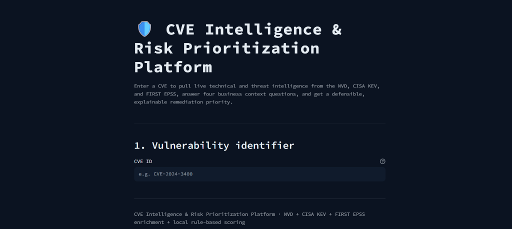
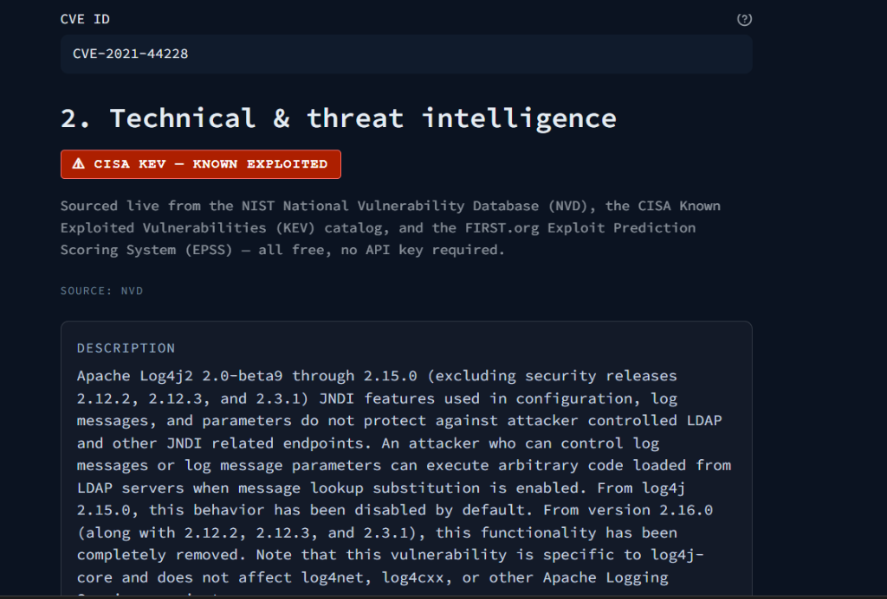
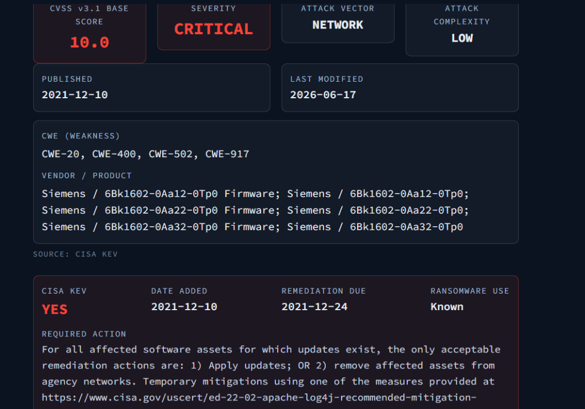
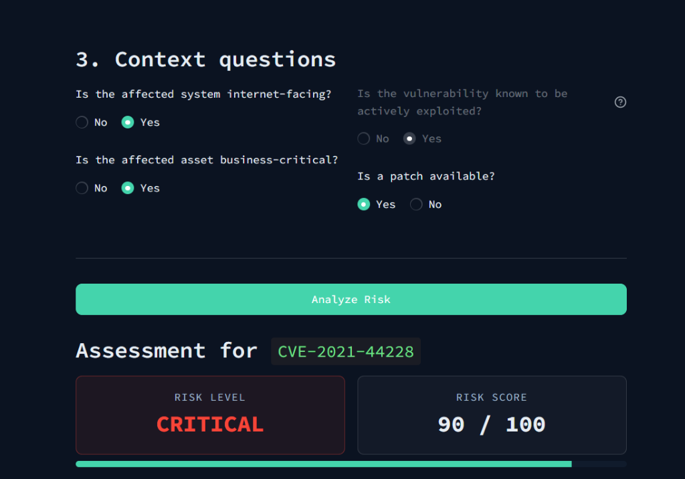

# CVE Intelligence & Risk Prioritization Platform



A Python-based vulnerability intelligence platform integrating NVD, CISA KEV, FIRST EPSS, and business-context risk scoring to generate explainable remediation priorities.

## Features

### Vulnerability & Threat Intelligence
Live integration with NVD for CVE descriptions, CVSS scores, and CWE data. Cross-referenced with the CISA Known Exploited Vulnerabilities (KEV) catalog and FIRST Exploit Prediction Scoring System (EPSS).



### Business-Context Risk Scoring
Answer four yes/no business context questions to generate a localized, rule-based 100-point risk score.


- **Explainable Remediation Priorities**: Outputs include Risk Level (Low/Medium/High/Critical), a numeric score breakdown, and a recommended remediation timeframe.
- **Local Scoring Engine**: All risk calculations are performed locally and deterministically without external or generative AI models.

## Architecture
- **Language**: Python 3.12
- **Framework**: Streamlit for the user interface.
- **APIs**: Free public data sources over HTTP (NVD, CISA KEV, FIRST EPSS). No database or paid APIs are used.

## Usage
1. Enter a valid CVE ID (e.g., CVE-2021-44228).
2. The platform will validate the CVE with NVD. If found, it fetches relevant intelligence data.
3. Review the technical and threat intelligence presented.
4. Answer the business context questions.
5. Click **Analyze** to generate the risk score and remediation recommendation.

## Setup
### Requirements
- Python 3.12+
- Dependencies listed in `requirements.txt`

### Installation
```bash
pip install -r requirements.txt
streamlit run app.py
```
